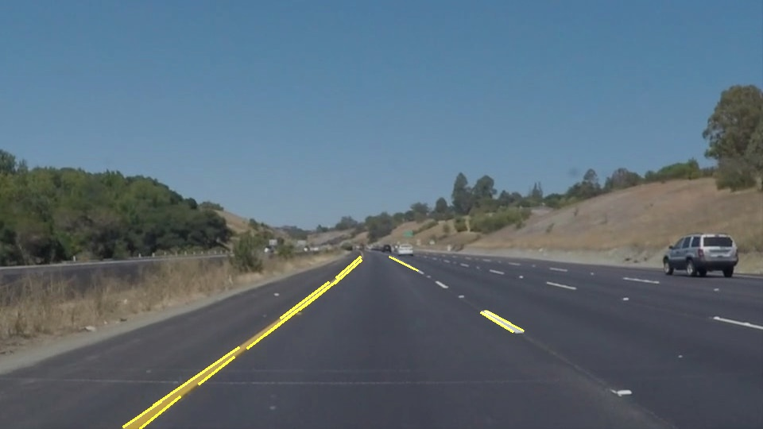

# **Finding Lane Lines on the Road** 
Author: Eduardo Escobar
### This document gives a brief description of the work I made to complete the first project of the Self-Driving Cars Nanodegree.

---

**Finding Lane Lines on the Road**

The goals / steps of this project are the following:
* Make a pipeline that finds lane lines on the road
* Reflect on your work in a written report

---

## Reflection

### 1. Building a Lane Finding Pipeline

The first step of this project was using the helper functions provided by Udacity to build a pipeline that allows to read an image, find the lane lines (if any) in that image and save the image with the lane lines highlited.

My pipeline was put together in the **detect_lines** function, and consisted of 8 steps: 

1. I took the path where the image is located as an argument, and I read the image (img).
1. Second, I converted the images to grayscale using the **grayscale** function.
2. Then, I used the **gaussian_blur** function to apply a Gaussian blur to the gray image. 
3. To this blured image I then applied the Canny transform (**canny** function) to obtain the edges in the image.
4. Before applying the Hough transformation, I first applied the **region_of_interest** function to the edges image. I made it this way because I am only interested in the edges and lines that are located within the region of interest. Applying the region of interest at this point and not, lets say, after the Hough transform does not affect the result in this first part, but it will be important when the *draw_lines* function is modified.
5. I used the **hough_lines** function to find the lines in the region of interest. This produces an image called *line_img*.
6. I applied the weighted_img function to combine the original image *img* with the *line_img* image, which contains the lines. This produces the output image *output_img*
7. Finally, I saved the output image in a path that is specified as an argument.

All the arguments of the different functions used in this pipeline were put into a dictionary called *parameters*. This makes it easier to tune the paremeters, since they are all in one place.

Using this pipeline, it is possible to enter this image:

And obtain this image (I changed the color of the lines so it is easier to see):

### 2. Test on videos

The pipeline previously defined was slightly modified to be used in videos. An alternate function **process_image** was made so it would take an image and the parameters as input and return a marked image as output.

Bellow, I show an output video, after applying this function:

<video width="480" height="270" controls src="test_videos_output/solidWhiteRight.mp4" />

### 3. Improve the draw_lines() function

In order to draw a single line on the left and right lanes, I modified the **draw_lines()** function through these steps:

1. I find the horizontal center of the image and name it as *half_img_x*.
2. All the lines that contain points *x1* and *x2* to the left of *half_img_x* are separated into one set. The same is done for the points that are to the right of *half_img_x*.
3. For each set of points (right points and left points), I calculate a linear regression, to obtain the slope and bias of each line.
4. Using the slope and bias of each line, I calculate the points (x,y) at the top and bottom of the interest region. This gives me 4 pairs of points (2 for each line).
5. Using the **cv2.line** function, I plot both lines on the image.

Here is the result of applying this new version of the function to a video:

<video width="480" height="270" controls src="test_videos_output/solidYellowLeft.mp4" />

### 4. Optional Challenge

The main difference with the challenge video is that the dimensions of it frames are different, and this changes the region of interest.

To adjust the parameters, I first captured several frames of the challenge video. With these frames I was able to determine the vertices of the new region of interest. Bellow, I show my result on the challenge video.

<video width="480" height="270" controls src="test_videos_output/challenge.mp4" />

### 5. Potential shortcomings and possible improvements

From the challenge video, it can be seen that the algorithm has difficulties finding the lane lines when the color of the pavement changes. This may be improved by, for example, determining the color of the floor in the image and define different set of parameters for different floor colors.

Other than that, I consider that muy pipeline, using the tools shown in the course so fat, works well enough.

